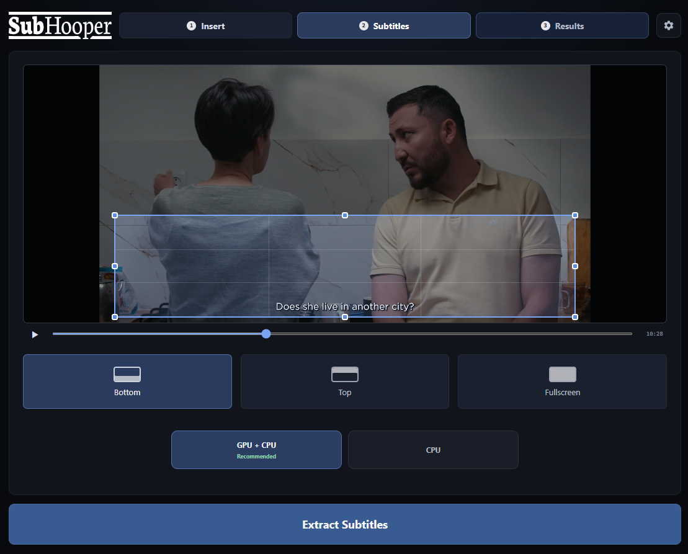
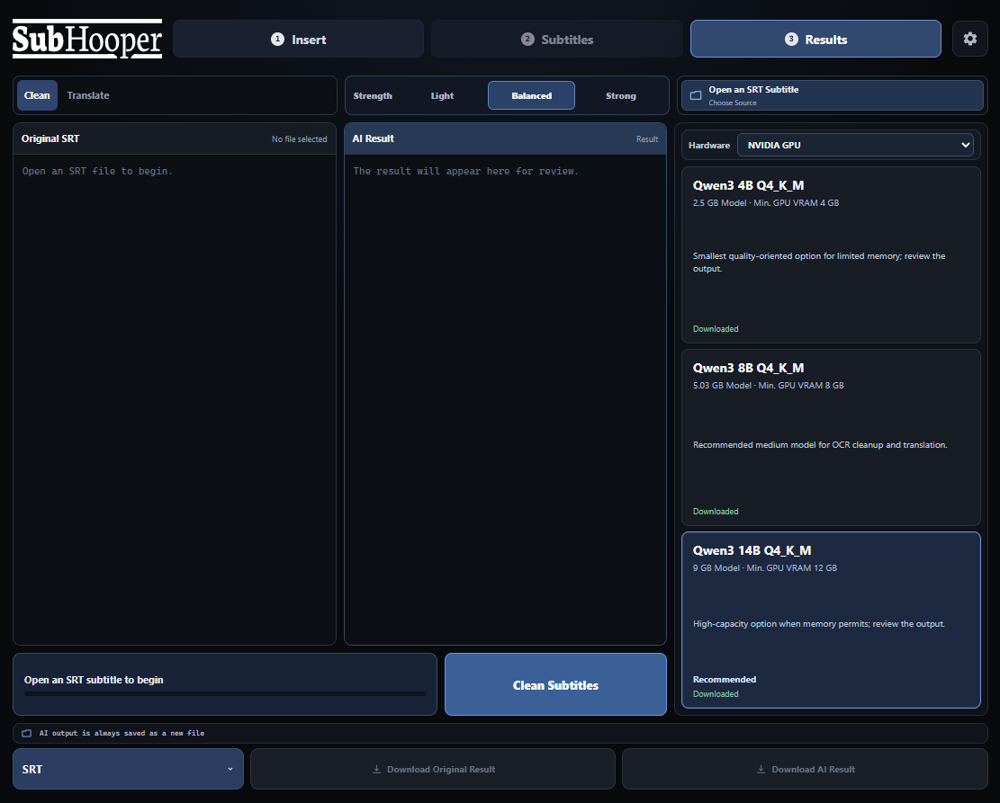

  

  <strong>An open-source Windows app for extracting, cleaning, and translating hardcoded subtitles.</strong> 
  Select the subtitle area, extract the text, and save it. 
  Optional AI cleanup and translation. Video and subtitle processing stays on the computer.

  
  
  
  
  
  

  <a href="https://github.com/lucretitus/SubHooper/releases/latest">Download for Windows</a> ·
  <a href="CHANGELOG.md">Release notes</a> ·
  <a href="https://github.com/lucretitus/SubHooper/issues">Report an issue</a>

<table>
  <tr>
    <td width="50%"></td>
    <td width="50%"></td>
  </tr>
</table>

[Features](#features) · [Get started](#get-started) · [Requirements](#requirements) · [Privacy](#privacy) · [Development](#development)

<table>
  <tr>
    <td width="50%">
      <h3>Extract from video</h3>
      
Choose the subtitle area in the video preview. Local OCR turns hardcoded subtitles into an editable subtitle file.

    </td>
    <td width="50%">
      <h3>Use the available hardware</h3>
      
Run on CPU or GPU + CPU with NVIDIA CUDA. Experimental DirectML support is available for compatible AMD and Intel graphics.

    </td>
  </tr>
  <tr>
    <td width="50%">
      <h3>Clean and translate locally</h3>
      
Use optional Qwen3 models to correct OCR errors or translate subtitles. Pick Light, Balanced, or Strong cleanup.

    </td>
    <td width="50%">
      <h3>Keep the original</h3>
      
Compare the original text with the AI output and export either result as SRT, TTML, plain text, or Markdown.

    </td>
  </tr>
</table>

## Features

### Choose what to extract

Open a video, preview it, and select a preset or custom subtitle region. Source videos are read directly; generated temporary files are cleaned after processing.

### Review before saving

Keep the original extraction available alongside the AI result. Cleanup and translation are optional, and exporting the original never requires an AI model.

### Bring existing subtitles

Open an SRT file and use the AI tools without installing the video extraction components. Translate the original subtitles or a cleaned result.

### Pick a local model

Choose Qwen3 4B, 8B, or 14B according to the available memory. Models download when explicitly starting an AI action; matching GGUF files can also be imported. Local AI runs on CPU or a supported NVIDIA GPU.

## Get started

1. [Download the Windows installer](https://github.com/lucretitus/SubHooper/releases/latest) and install SubHooper.
2. Open a video and select the subtitle area.
3. Install the extraction components from Settings when prompted, then extract.
4. Review the result. Optionally clean or translate it, then export the original or AI result.

After upgrading, use **Settings > Video Extraction Components > Verify Components** if GPU + CPU needs verification. CPU and GPU runtime status are checked separately.

## Requirements

| Component | Support |
| --- | --- |
| Operating system | Windows x64 |
| CPU OCR | Available without a supported GPU |
| NVIDIA GPU OCR | CUDA; tested on GTX 1660 SUPER and RTX 4070 |
| AMD / Intel GPU OCR | Experimental DirectML on DirectX 12-capable graphics, including integrated GPUs |
| Local AI | CPU or a supported NVIDIA CUDA GPU; model choice depends on available memory |

GPU + CPU OCR prefers NVIDIA CUDA. DirectML validates model execution on a hardware adapter before processing. AMD/Intel throughput and output quality have not been measured; integrated graphics may be slower than CPU. Explicit GPU errors stop processing instead of silently switching to CPU.

## Privacy

Video, OCR, cleanup, and translation run locally. Internet access is needed for component and model downloads and update checks. Downloaded components and saved results are kept in LocalAppData.

OCR and AI output can contain mistakes. Review subtitle text and timing before use.

## Development

Built with Tauri, Rust, React, and a local Python / ONNX OCR engine. See [CONTRIBUTING.md](CONTRIBUTING.md) for source setup, checks, and releases, and [SECURITY.md](SECURITY.md) for security reporting.

## License

[MIT](LICENSE). Downloaded components retain their own licenses; see [THIRD_PARTY_NOTICES.md](THIRD_PARTY_NOTICES.md).
